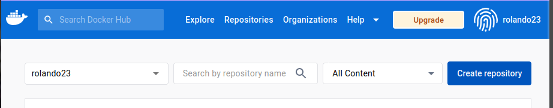
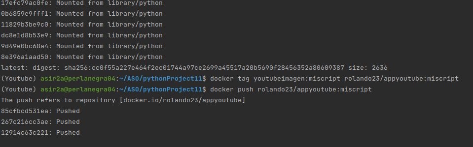
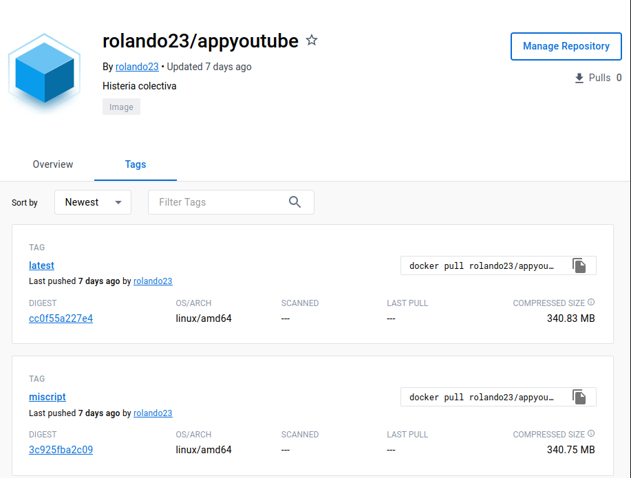

Combinar script de Python con Docker
===

---
Primero vamos a especificar que librerías queremos instalar en nuestra imagen personalizada, para esto debemos crear el fichero ___Dockerfile___

```yml
FROM python:3

WORKDIR /usr/src/app

RUN pip install pytube

COPY ./app /usr/src/app

CMD ["python", "miscript.py"]

```

En la dirección que marca el **Workdir** creamos los ficheros de código que se cargarán con las imágenes, en mi caso miscript.py

Para crear nuestra propia imagen personalizada de un contenedor de docker debemos ejecutar el comando:


`$ docker build -t youtubeimagen:latest .`

Luego configuramos el `docker-compose buil.yml` y el `docker-compose.yml`

```yml
services:
  python:
    image: youtubeimagen:latest
    build: .
    stdin_open: true
    tty: true
    command: ['python', 'hola.py']
```

Finalmente levantamos el servicio con nuestra propia imagen:

`$ docker-compose up`

Y ya tendremos nuestro contenedor con el script que hayamos especificado en ejecución en "command:

Para subirlo a [DockerHub](https://hub.docker.com/) primeramente debemos ir a nuestro perfil y presionar en "Create repository":



Luego de crearlo nos movemos a la terminal y ejecutamos los siguientes comandos:

`$ docker login` Introducimos los parámetros de cuenta y contraseña de docker hub.

`$ docker tag youtubeimagen:latest rolando23:youtubeimage .` (¡IMPORTANTE!) No olvidarse el punto del final. imagen:version cuentaDockerHub:repositorio

`$ docker push rolando23/youtubeimage:latest` cuentaDockerHub/repositorio:version

A base de hacer **tag** y **push** podremos ir añadiendo imagenes a nuestro repositorio de dockerhub, si queremos comprobar el funcionamiento de la misma solo tendremos que escribir 
`docker run rolando23/appyoutube:miscript`



Resultado luego de subir dos imágenes;


---
Repositorio encontrable en 
[```rolando23/appyoutube```](https://hub.docker.com/r/rolando23/appyoutube)
